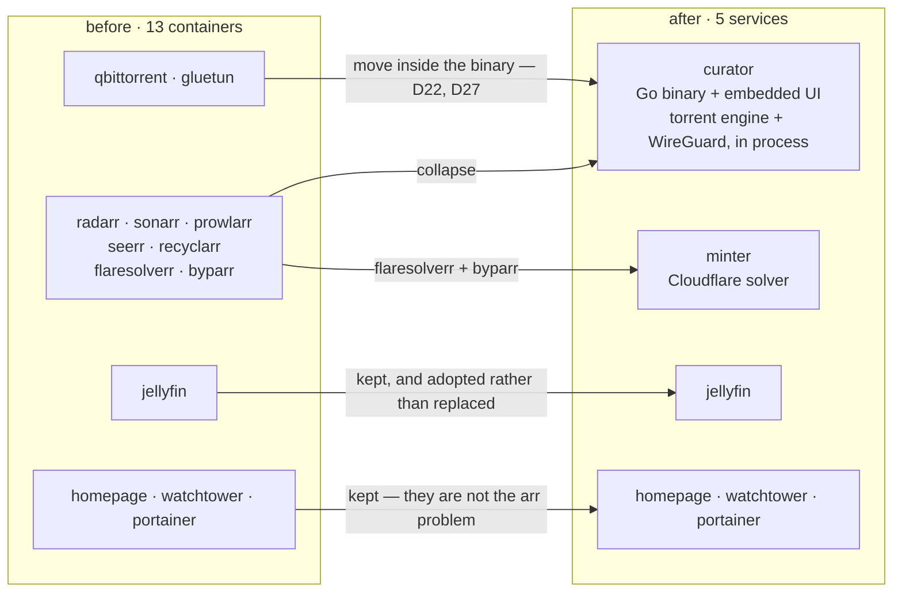
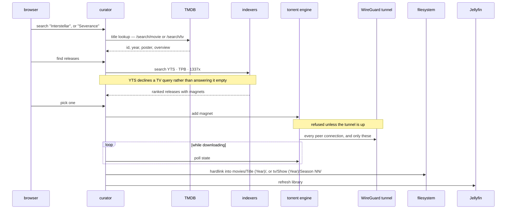
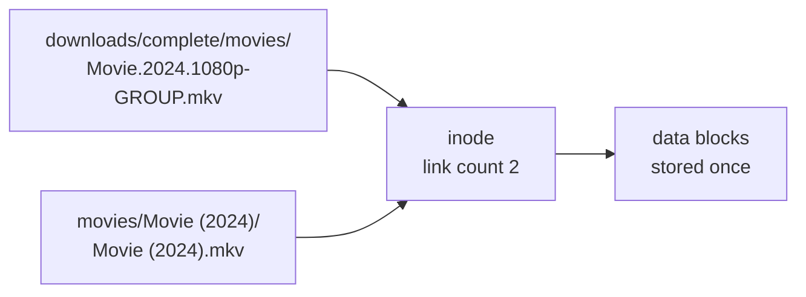
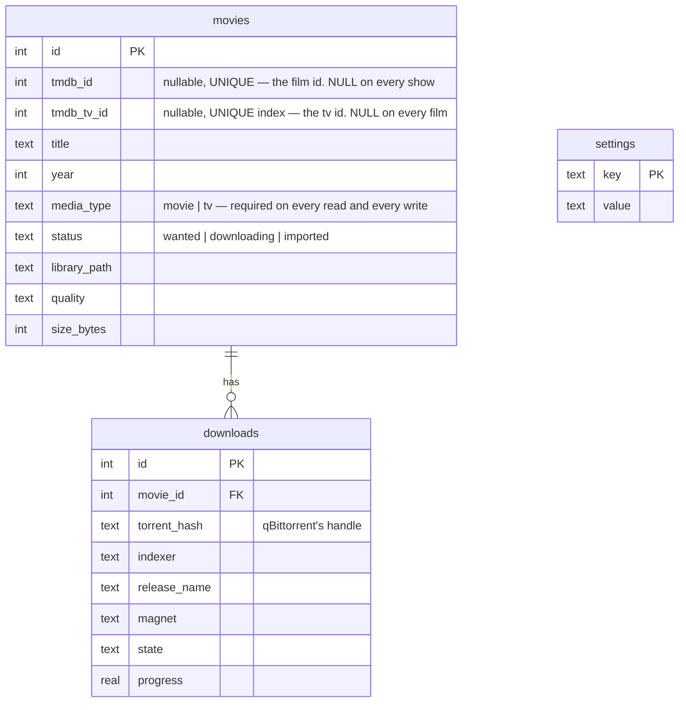

# Architecture

`curator` is one Go binary that does what nine containers used to: take a request for a movie — or,
since phase 11, a television show — find a release, download it over a tunnel it brought up itself,
file it into the library, and tell Jellyfin to pick it up.

## What it replaces

The Pi ran 13 containers. Nine of them existed to generalise across 500+ indexers, private trackers
with ratio rules, custom format scoring and multi-user request queues — or to carry the torrent
client and its VPN. The actual usage is one user, a few dozen movies and three public sources.



**Jellyfin stays** because transcoding, client apps and subtitles are a genuinely hard problem that
is not the \*arr problem, and it exposes a clean API. curator adopts an existing one rather than
replacing it.

**qBittorrent and gluetun did not stay.** They were kept in the original plan for the same reason —
DHT, the peer wire protocol and piece selection are hard — and phase 6 reversed that
([D22](decisions.md#d22--the-torrent-engine-moves-inside-the-binary-and-qbittorrent-becomes-the-second-backend)):
a pure-Go engine in curator's own process is what makes one tunnel, one socket and one mandatory-VPN
promise possible ([D27](decisions.md#d27--the-vpn-is-mandatory-and-curator-owns-the-socket)).
qBittorrent remains as the *second* backend for anyone migrating, selected with
`TORRENT_BACKEND=qbittorrent`, and it is not a dependency.

That count is the Pi's, and it is not the product's number. For anyone else, curator is **one
container** — plus Jellyfin and minter as opt-in profiles. See
[`roadmap.md`](roadmap.md#the-container-arithmetic-which-moved-twice) for why the arithmetic moved
twice.

## The pipeline



**The engine and the tunnel are inside curator's process**, not two more containers — the participant
boxes are packages, not services. And the tunnel carries the torrent traffic **and nothing else**,
which since [D47](decisions.md#d47--every-torrent-network-operation-is-tunnel-bound-or-disabled) is
true in both directions: every network operation the torrent subsystem makes is tunnel-bound or
disabled, DHT bootstrap DNS, WebTorrent and UPnP included. Meanwhile
TMDB, the indexers, Jellyfin and the UI all go out over the host's own connection, so a tunnel that
drops stops downloads instead of locking somebody out of their library.

Downloads are **manually triggered** — you search, you see ranked releases, you pick one. No
background monitoring or scoring heuristics. For a single user that is usually better than
automation, and it is dramatically less code: quality scoring and release ranking are most of what
Radarr's complexity actually buys.

**That is one pipeline for two media types, and the second one is off until asked for.** Phase 11
added television without adding a second pipeline: the same TMDB client, the same indexers, the same
engine, the same tunnel, the same hardlink. What actually branches is small and is listed here so
nobody goes looking for a parallel stack — the TMDB endpoint (`/search/tv`, `/tv/{id}`), the
indexer query (TPB's `cat=205,208`, 1337x's `<title> S02`, and YTS declining outright), the
destination on disk, and the Jellyfin item type. A show is a **row in `movies`**, not a table of its
own, because `downloads.movie_id` is `NOT NULL` and a separate `shows` table would still need a
shadow row in this one
([D48](decisions.md#d48--television-is-additive-a-show-is-a-row-in-movies-and-the-second-library-root-is-opt-in)).

`LIBRARY_TV` has **no default**, and empty means television is off — no TV root walked, no TV row
pruned, and the television routes answering 503 naming the variable
([D40](decisions.md#d40--a-refusals-sentence-is-written-at-the-boundary-that-answers-it)). It is the
same posture `QBIT_USER` and `JELLYFIN_URL` already have. Playback is the one thing the film half has
and the television half does not: `/api/movies/{id}/stream` serves one file per row, a show is a
folder of many, and `stream.go`'s `AssertInside(libraryRoot, …)` refuses a row under the TV root by
construction. Episodes play in Jellyfin, which is what its `Shows` library is for.

## Why importing hardlinks

Downloads and the library sit on the same ext4 filesystem (verified: both report device `2049`).
A hardlink is a second directory entry pointing at the same inode.



A move would break seeding; a copy would double disk usage on a drive that has already been filled
once. A hardlink does neither — it is instant, free, and both names stay valid independently.
Falls back to a copy on `EXDEV` if the paths ever land on different filesystems.

**A season pack is the same rule, N times.** Each episode gets its own link into
`Show (Year)/Season NN/`, each destination is checked to be inside the TV root, and the row records
the **show folder** rather than a file — which is what lets season 2 arrive six months after season 1
and land on the same row. Re-grabbing a season is idempotent for free: the same inode at the
destination is success, and a *different* file there is an error rather than an overwrite. The
consequence for `EXDEV` is worth stating plainly, because it is the one that costs real disk: a `tv/`
directory on a different filesystem from `downloads/` stores **every episode twice**, silently.

## Components

| Package | Responsibility |
|---|---|
| `internal/config` | Environment-driven settings, read once at startup. `TVConfigured()` is the one place to ask whether television is on |
| `internal/store` | SQLite — schema, migrations, queries. Pure-Go driver. Every media-scoped read takes a **required** media type, with no value meaning "both" |
| `internal/library` | Disk scanning, `Title (Year)` parsing, `SxxEyy` parsing, hardlink import |
| `internal/tmdb` | Metadata lookup and matching, for films and shows, onto one `Match` |
| `internal/indexer` | Release search across sources behind one interface |
| `internal/importer` | Files a completed download: one link for a film, one per episode for a season |
| `internal/api` | HTTP handlers, serves the embedded UI |

## Indexers

One small interface is what Prowlarr's 23 MB of configuration reduces to when you need four public
sources:

```go
type Query struct {
    Title  string
    Year   int      // ignored for TV: a show's first-air year is not an episode's
    Media  string   // "movie" or "tv"; empty means "movie"
    Season int      // 0 is no constraint; only 1337x puts it in the query it sends
}

type Release struct {
    Title     string
    Year      int
    Quality   string   // "1080p", "2160p"
    SizeBytes int64
    Seeders   int
    Magnet    string
    Indexer   string
    Season    int      // read off the NAME, not the query; 0 means it does not say
    Episode   int
}

type Indexer interface {
    Name() string
    Search(ctx context.Context, q Query) ([]Release, error)
}

// Implemented only by an indexer that does NOT handle every media type, the way
// MagnetResolver describes one source's limitation rather than everyone's. Not
// implementing it means "handles everything", so YTS is the only one that says
// anything: /list_movies.json is its whole surface.
type MediaCapable interface {
    Handles(media string) bool
}
```

`SearchMovie(ctx, title, year)` became `Search(ctx, Query)` when television arrived, and **replacing
the method rather than adding a second one was the point**: the media type is not expressible inside
a title, so an indexer that never learns it does not fail — it answers a *film* search carrying a
show's name and reports the nothing it finds as `ok:true, count:0`. That is D20's documented
indistinguishable case, which is also why YTS declining is a third outcome, `not applicable`, rather
than an empty result.

| Source | Access | Media | Cost | Notes |
|---|---|---|---|---|
| YTS | `movies-api.accel.li/api/v2` | films only | fast | Returns `quality`, `size_bytes`, `hash` as fields — no name parsing. **Not `yts.mx`**, which is NXDOMAIN ([D12](decisions.md#d12--yts-is-reached-at-movies-apiaccelli-not-ytsmx)); `yts.rs` and `yts.hn` are clone sites running a re-implemented API. The only `MediaCapable` implementation: it declines TV rather than answering it empty |
| The Pirate Bay | `apibay.org/q.php` | both | fast | JSON; build magnet from `info_hash`, parse quality from the name. Television is `cat=205,208`, and the query stays the **bare title** — narrowing it to a season costs the best pack the show has |
| 1337x | HTML via `minter` | both | ~9 s | Broadest catalogue. Behind Cloudflare, so it goes through minter. The one source the season *does* go into the query for, as `<title> S02` |
| EZTV | `eztv.re/api` | — | — | Structured season/episode, and **still not used**. This row said *"TV, a later phase"* from phase 2 until phase 11 — and that phase arrived and did not need it: TPB's TV categories and 1337x's keyword search were enough, so a fourth indexer stayed deliberately out of scope ([phase-11.md](phase-11.md)) |

Searching TPB for `severance` with `cat=205,208` returns 100 rows carrying season packs *and* single
episodes — `Severance - Season 1 - Mp4 x264 AC3 1080p` at 844 seeders beside
`Severance S02E05 … WEB-DL` at 381 (measured 2026-08-20). Narrowing the query to `severance s02`
returns 8 rows and `severance season 2` returns a different 4, and the 727-seeder Season 2 pack is in
neither: apibay matches keywords against the release name, so the two spellings are two subsets of
one thing. The season is therefore **read back off each name** rather than asked for — the same
posture the year already had, where narrowing happens only where "ambiguous" is allowed to mean
"keep".

Searches run concurrently with `errgroup`; a failing indexer is omitted, never fatal. 1337x hides
magnets on detail pages, so resolution is **lazy** — only the release you pick costs a second fetch,
turning a 20-result search from 21 protected requests into 2 per download.

## Data model

Three tables, and television added no fourth: **a show is a row in `movies`**. Phase 1 wrote only
that table; the others exist so later phases need no migration.



`torrent_hash` is the primary handle for a download rather than the full magnet: it is the stable
identifier, and it is what qBittorrent uses too. Everything else in a magnet — display name, tracker
list — is optional metadata a client can do without.

**`tmdb_tv_id` is a second column rather than a second use of `tmdb_id`, and that is forced.** TMDB's
movie and tv id sequences overlap — Severance is tv id 95396 and a film holds movie id 95396 — while
`tmdb_id` is `UNIQUE` at table level and the migration mechanism is `addColumn`, which cannot relax a
constraint. Sharing the column would not have been a rare loud collision: dispatching Severance would
have found the film's row and attached the season pack to it, with no error. The new column is
nullable and its UNIQUE index tolerates that, because SQLite treats NULLs as distinct — so every film
coexists under it and only two rows claiming the same show are refused
([D48](decisions.md#d48--television-is-additive-a-show-is-a-row-in-movies-and-the-second-library-root-is-opt-in)).

## Deployment

[`compose.yaml`](../compose.yaml) at the repository root is the deployment, and it is also the
quickstart — a stranger curls that one file and runs `docker compose up -d`. What it contains is
mostly comments explaining why each line is there; what it *configures* is close to nothing:

```yaml
curator:
  image: ghcr.io/dulsaranethmin/curator:latest
  user: "${PUID:-1000}:${PGID:-1000}"
  ports:
    - "${CURATOR_PORT:-8090}:8090"
  environment:
    DB_PATH:        /data/curator.db
    LIBRARY_MOVIES: /media/movies
    DOWNLOADS_DIR:  /media/downloads
    MINTER_URL:     http://minter:8191    # where minter is on THIS network
    # LIBRARY_TV:   /media/tv             # commented out: television is opt-in
  volumes:
    - data:/data                          # database + the key its secrets use
    - media:/media                        # movies/, tv/ and downloads/, one filesystem
```

Four details, each of which is a decision rather than a default.

**One volume for media, with every directory inside it.** The importer hardlinks and falls back to
a copy on `EXDEV` ([D8](decisions.md#d8--import-by-hardlink)), so downloads and library must share a
filesystem — two volumes would put them on two, and the failure is silent until a disk fills. That
applies to `tv/` in exactly the same way and costs more when it is wrong, because a season is many
files rather than one.

**`LIBRARY_TV` is present and commented out**, which is the shape an opt-in setting takes in a file
somebody reads to find out where their media lives. It has no default, and empty means television is
off — a default would point curator at a directory nobody asked it to write to, and would turn
television on for every existing install on the next image. An environment key that is already there
and commented gets edited correctly; one that has to be known about and added is how a bind mount
ends up pointing at a directory nothing scans.

**`/data` holds the database and the key its secrets are encrypted with, together on purpose.**
Anything that copies the volume copies both, and a database restored without its key keeps every row
and cannot read one secret back
([D28](decisions.md#d28--settings-are-writable-secrets-are-encrypted-at-rest-and-write-only-across-the-api)).

**No TMDB key, no tunnel, no Jellyfin URL.** Phase 7 made all of those writable from the browser and
stored encrypted, so putting them here would tell a stranger to edit YAML for the thing the Settings
screen exists to do. `MINTER_URL` is the exception and the difference is which direction the value
travels: nothing writes it, because it is a fact about this network's topology rather than a setting.
`JELLYFIN_URL` is deliberately absent for the opposite reason — curator *writes* that one, and an
environment value would beat what the provisioning flow just stored.

Jellyfin, minter and the updater are **profiles**, so none of them arrives with a bare `up -d`
([D34](decisions.md#d34--curator-provisions-a-jellyfin-it-brought-up-and-never-rewrites-one-somebody-is-already-watching),
[D44](decisions.md#d44--curator-reads-the-version-something-else-installs-it)).
