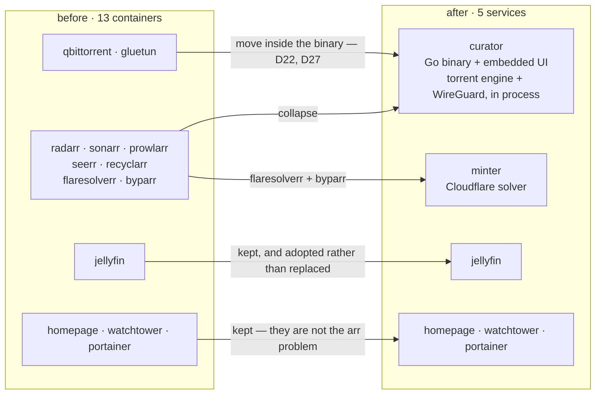
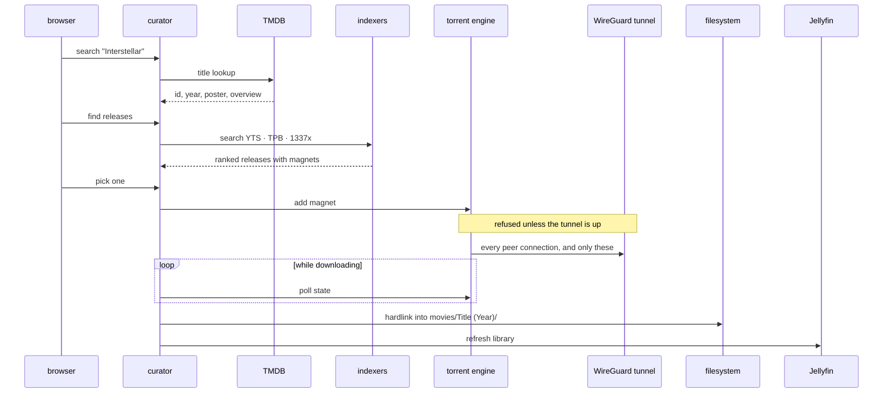
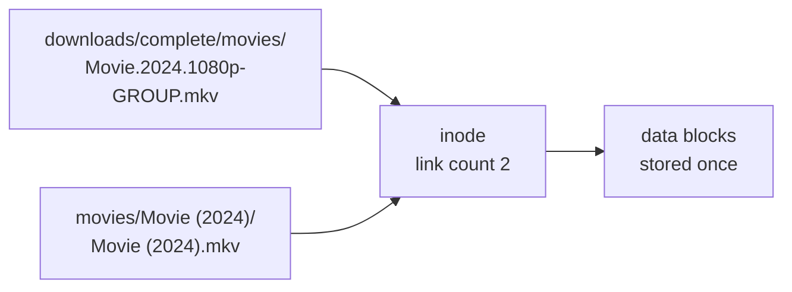
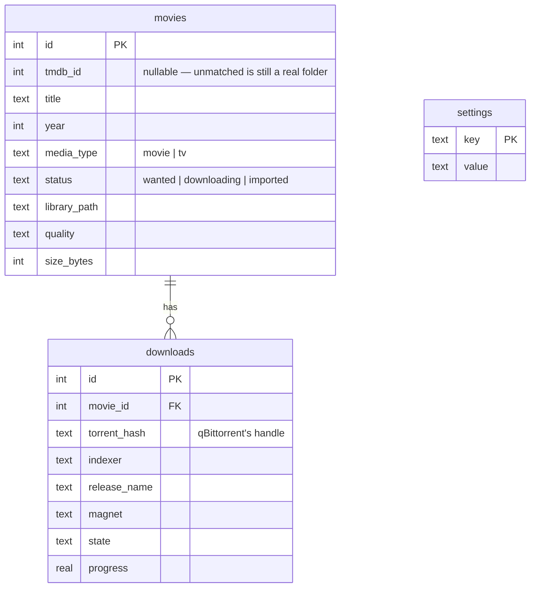

# Architecture

`curator` is one Go binary that does what nine containers used to: take a request for a movie, find a
release, download it over a tunnel it brought up itself, file it into the library, and tell Jellyfin
to pick it up.

## What it replaces

The Pi ran 13 containers. Nine of them existed to generalise across 500+ indexers, private trackers
with ratio rules, custom format scoring and multi-user request queues — or to carry the torrent
client and its VPN. The actual usage is one user, a few dozen movies and three public sources.



**Jellyfin stays** because transcoding, client apps and subtitles are a genuinely hard problem that
is not the \*arr problem, and it exposes a clean API. curator adopts an existing one rather than
replacing it.

**qBittorrent and gluetun did not stay.** They were kept in the original plan for the same reason —
DHT, the peer wire protocol and piece selection are hard — and phase 6 reversed that
([D22](decisions.md#d22--the-torrent-engine-moves-inside-the-binary-and-qbittorrent-becomes-the-second-backend)):
a pure-Go engine in curator's own process is what makes one tunnel, one socket and one mandatory-VPN
promise possible ([D27](decisions.md#d27--the-vpn-is-mandatory-and-curator-owns-the-socket)).
qBittorrent remains as the *second* backend for anyone migrating, selected with
`TORRENT_BACKEND=qbittorrent`, and it is not a dependency.

That count is the Pi's, and it is not the product's number. For anyone else, curator is **one
container** — plus Jellyfin and minter as opt-in profiles. See
[`roadmap.md`](roadmap.md#the-container-arithmetic-which-moved-twice) for why the arithmetic moved
twice.

## The pipeline



**The engine and the tunnel are inside curator's process**, not two more containers — the participant
boxes are packages, not services. And the tunnel carries the torrent traffic **and nothing else**,
which since [D47](decisions.md#d47--every-torrent-network-operation-is-tunnel-bound-or-disabled) is
true in both directions: every network operation the torrent subsystem makes is tunnel-bound or
disabled, DHT bootstrap DNS, WebTorrent and UPnP included. Meanwhile
TMDB, the indexers, Jellyfin and the UI all go out over the host's own connection, so a tunnel that
drops stops downloads instead of locking somebody out of their library.

Downloads are **manually triggered** — you search, you see ranked releases, you pick one. No
background monitoring or scoring heuristics. For a single user that is usually better than
automation, and it is dramatically less code: quality scoring and release ranking are most of what
Radarr's complexity actually buys.

## Why importing hardlinks

Downloads and the library sit on the same ext4 filesystem (verified: both report device `2049`).
A hardlink is a second directory entry pointing at the same inode.



A move would break seeding; a copy would double disk usage on a drive that has already been filled
once. A hardlink does neither — it is instant, free, and both names stay valid independently.
Falls back to a copy on `EXDEV` if the paths ever land on different filesystems.

## Components

| Package | Responsibility |
|---|---|
| `internal/config` | Environment-driven settings, read once at startup |
| `internal/store` | SQLite — schema, migrations, queries. Pure-Go driver |
| `internal/library` | Disk scanning, `Title (Year)` parsing, hardlink import |
| `internal/tmdb` | Metadata lookup and matching |
| `internal/indexer` | Release search across sources behind one interface |
| `internal/api` | HTTP handlers, serves the embedded UI |

## Indexers

One small interface is what Prowlarr's 23 MB of configuration reduces to when you need four public
sources:

```go
type Release struct {
    Title     string
    Year      int
    Quality   string   // "1080p", "2160p"
    SizeBytes int64
    Seeders   int
    Magnet    string
    Indexer   string
}

type Indexer interface {
    Name() string
    SearchMovie(ctx context.Context, title string, year int) ([]Release, error)
}
```

| Source | Access | Cost | Notes |
|---|---|---|---|
| YTS | `movies-api.accel.li/api/v2` | fast | Returns `quality`, `size_bytes`, `hash` as fields — no name parsing. **Not `yts.mx`**, which is NXDOMAIN ([D12](decisions.md#d12--yts-is-reached-at-movies-apiaccelli-not-ytsmx)); `yts.rs` and `yts.hn` are clone sites running a re-implemented API |
| The Pirate Bay | `apibay.org/q.php` | fast | JSON; build magnet from `info_hash`, parse quality from the name |
| 1337x | HTML via `minter` | ~9 s | Broadest catalogue. Behind Cloudflare, so it goes through minter |
| EZTV | `eztv.re/api` | fast | Structured season/episode — TV, a later phase |

Searches run concurrently with `errgroup`; a failing indexer is omitted, never fatal. 1337x hides
magnets on detail pages, so resolution is **lazy** — only the release you pick costs a second fetch,
turning a 20-result search from 21 protected requests into 2 per download.

## Data model

Three tables. Phase 1 only writes `movies`; the others exist so later phases need no migration.



`torrent_hash` is the primary handle for a download rather than the full magnet: it is the stable
identifier, and it is what qBittorrent uses too. Everything else in a magnet — display name, tracker
list — is optional metadata a client can do without.

## Deployment

[`compose.yaml`](../compose.yaml) at the repository root is the deployment, and it is also the
quickstart — a stranger curls that one file and runs `docker compose up -d`. What it contains is
mostly comments explaining why each line is there; what it *configures* is close to nothing:

```yaml
curator:
  image: ghcr.io/dulsaranethmin/curator:latest
  user: "${PUID:-1000}:${PGID:-1000}"
  ports:
    - "${CURATOR_PORT:-8090}:8090"
  environment:
    DB_PATH:        /data/curator.db
    LIBRARY_MOVIES: /media/movies
    DOWNLOADS_DIR:  /media/downloads
    MINTER_URL:     http://minter:8191    # where minter is on THIS network
  volumes:
    - data:/data                          # database + the key its secrets use
    - media:/media                        # movies/ and downloads/, one filesystem
```

Three details, each of which is a decision rather than a default.

**One volume for media, with both directories inside it.** The importer hardlinks and falls back to
a copy on `EXDEV` ([D8](decisions.md#d8--import-by-hardlink)), so downloads and library must share a
filesystem — two volumes would put them on two, and the failure is silent until a disk fills.

**`/data` holds the database and the key its secrets are encrypted with, together on purpose.**
Anything that copies the volume copies both, and a database restored without its key keeps every row
and cannot read one secret back
([D28](decisions.md#d28--settings-are-writable-secrets-are-encrypted-at-rest-and-write-only-across-the-api)).

**No TMDB key, no tunnel, no Jellyfin URL.** Phase 7 made all of those writable from the browser and
stored encrypted, so putting them here would tell a stranger to edit YAML for the thing the Settings
screen exists to do. `MINTER_URL` is the exception and the difference is which direction the value
travels: nothing writes it, because it is a fact about this network's topology rather than a setting.
`JELLYFIN_URL` is deliberately absent for the opposite reason — curator *writes* that one, and an
environment value would beat what the provisioning flow just stored.

Jellyfin, minter and the updater are **profiles**, so none of them arrives with a bare `up -d`
([D34](decisions.md#d34--curator-provisions-a-jellyfin-it-brought-up-and-never-rewrites-one-somebody-is-already-watching),
[D44](decisions.md#d44--curator-reads-the-version-something-else-installs-it)).
