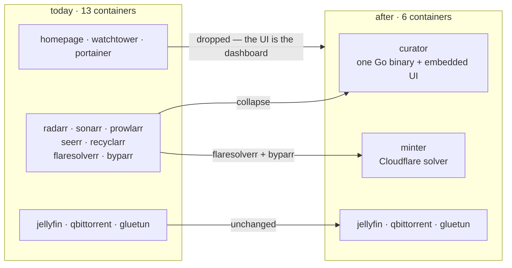
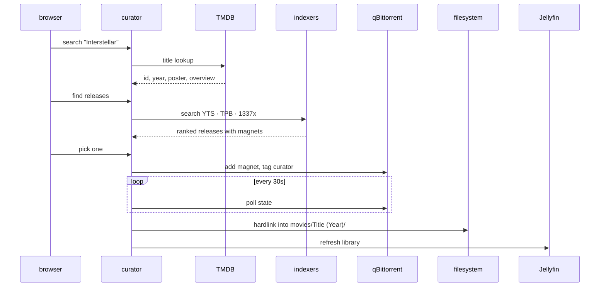
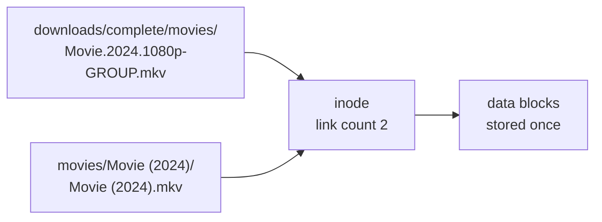
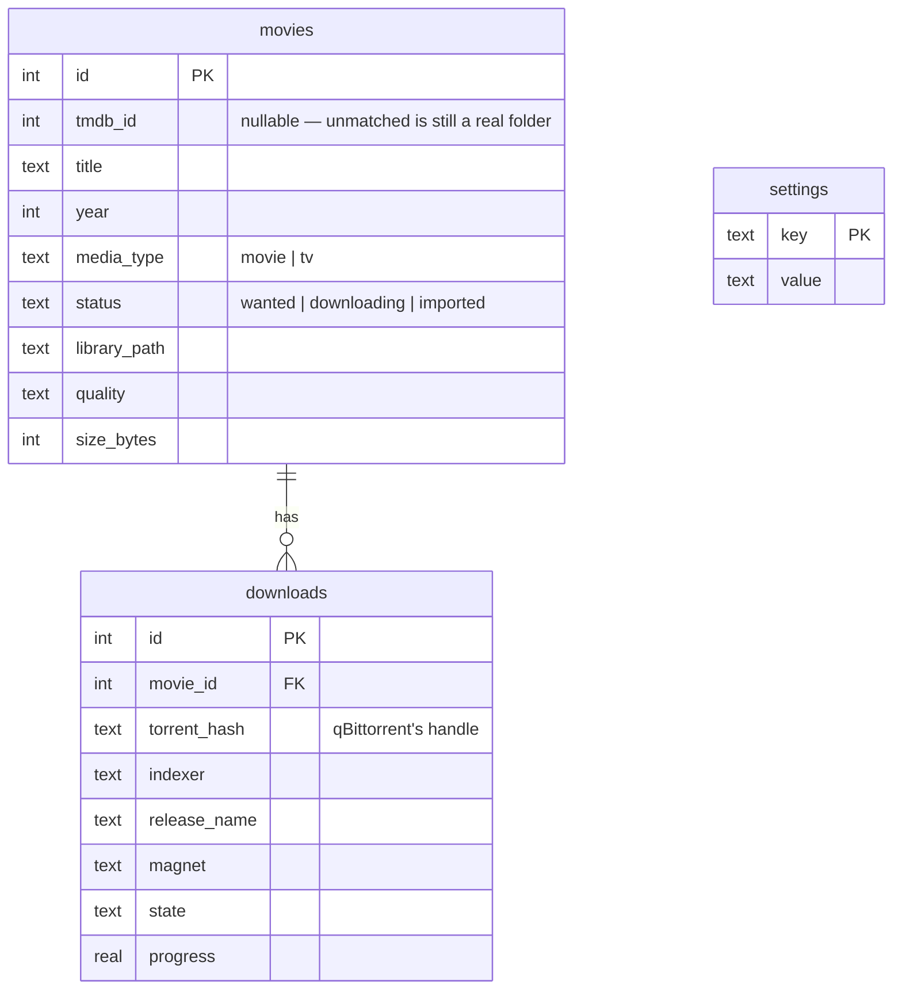

# Architecture

`curator` is one Go binary that does what seven containers do today: take a request for a movie,
find a release, download it, file it into the library, and tell Jellyfin to pick it up.

## What it replaces

The Pi currently runs 13 containers. Seven of them exist to generalise across 500+ indexers,
private trackers with ratio rules, custom format scoring and multi-user request queues. The actual
usage is one user, 29 movies and a handful of public sources.



Jellyfin and qBittorrent stay because they solve genuinely hard problems — transcoding, client apps
and subtitles on one side; DHT, peer wire protocol and piece selection on the other. Neither is part
of the *arr problem, and both expose clean APIs.

## The pipeline



Downloads are **manually triggered** — you search, you see ranked releases, you pick one. No
background monitoring or scoring heuristics. For a single user that is usually better than
automation, and it is dramatically less code: quality scoring and release ranking are most of what
Radarr's complexity actually buys.

## Why importing hardlinks

Downloads and the library sit on the same ext4 filesystem (verified: both report device `2049`).
A hardlink is a second directory entry pointing at the same inode.



A move would break seeding; a copy would double disk usage on a drive that has already been filled
once. A hardlink does neither — it is instant, free, and both names stay valid independently.
Falls back to a copy on `EXDEV` if the paths ever land on different filesystems.

## Components

| Package | Responsibility |
|---|---|
| `internal/config` | Environment-driven settings, read once at startup |
| `internal/store` | SQLite — schema, migrations, queries. Pure-Go driver |
| `internal/library` | Disk scanning, `Title (Year)` parsing, hardlink import |
| `internal/tmdb` | Metadata lookup and matching |
| `internal/indexer` | Release search across sources behind one interface |
| `internal/api` | HTTP handlers, serves the embedded UI |

## Indexers

One small interface is what Prowlarr's 23 MB of configuration reduces to when you need four public
sources:

```go
type Release struct {
    Title     string
    Year      int
    Quality   string   // "1080p", "2160p"
    SizeBytes int64
    Seeders   int
    Magnet    string
    Indexer   string
}

type Indexer interface {
    Name() string
    SearchMovie(ctx context.Context, title string, year int) ([]Release, error)
}
```

| Source | Access | Cost | Notes |
|---|---|---|---|
| YTS | `yts.mx/api/v2` | fast | Returns `quality`, `size_bytes`, `hash` as fields — no name parsing |
| The Pirate Bay | `apibay.org/q.php` | fast | JSON; build magnet from `info_hash`, parse quality from the name |
| 1337x | HTML via `minter` | ~9 s | Broadest catalogue. Behind Cloudflare, so it goes through minter |
| EZTV | `eztv.re/api` | fast | Structured season/episode — TV, a later phase |

Searches run concurrently with `errgroup`; a failing indexer is omitted, never fatal. 1337x hides
magnets on detail pages, so resolution is **lazy** — only the release you pick costs a second fetch,
turning a 20-result search from 21 protected requests into 2 per download.

## Data model

Three tables. Phase 1 only writes `movies`; the others exist so later phases need no migration.



`torrent_hash` is the primary handle for a download rather than the full magnet: it is the stable
identifier, and it is what qBittorrent uses too. Everything else in a magnet — display name, tracker
list — is optional metadata a client can do without.

## Deployment

One service on the existing `media` network, replacing seven:

```yaml
curator:
  image: ghcr.io/dulsaranethmin/curator:latest
  environment:
    TMDB_API_KEY:   ${TMDB_API_KEY}
    QBIT_URL:       http://gluetun:8080     # qBittorrent shares gluetun's netns
    MINTER_URL:     http://minter:8191
    JELLYFIN_URL:   http://jellyfin:8096
    LIBRARY_MOVIES: /media/storage/media/movies
    DOWNLOADS_PATH: /media/storage/media/downloads
  volumes:
    - /opt/docker/configs/curator:/config   # SQLite lives here
    - /media/storage:/media/storage         # identical path — hardlinks resolve
  networks: [media]
```

Two details carried from the existing stack. qBittorrent is reachable at `gluetun:8080` because it
shares that network namespace — exactly how Radarr is configured today. And mounting
`/media/storage` at the *identical* path inside the container is what keeps hardlink source and
destination on one filesystem.
